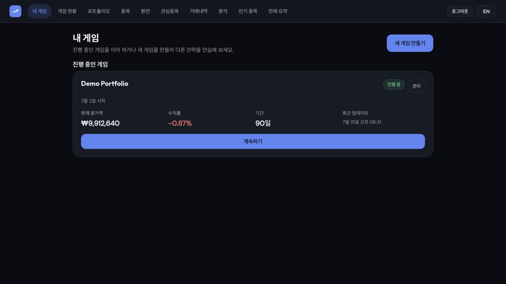
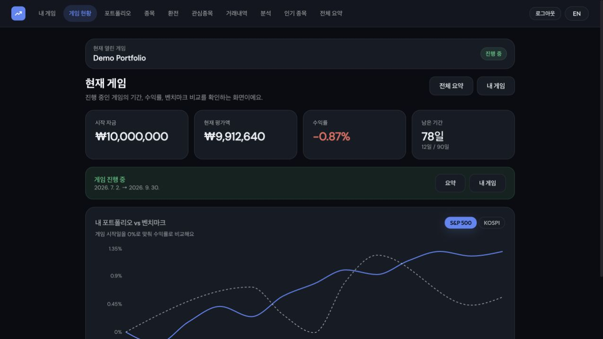
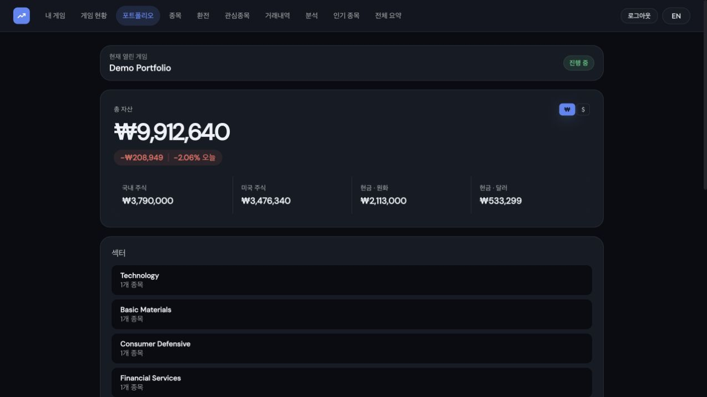
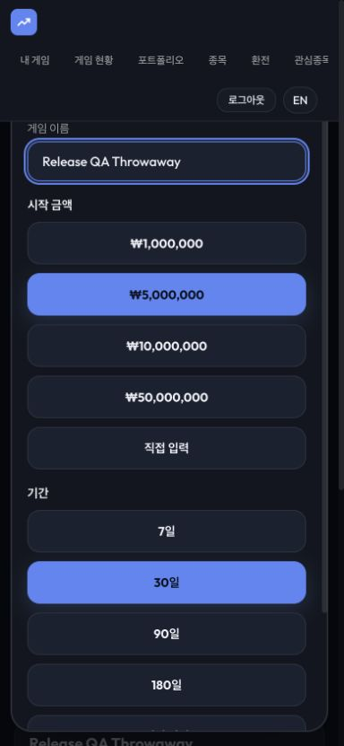
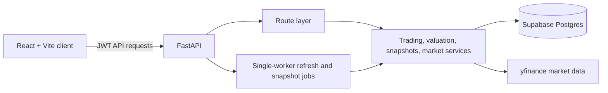

# Stock Game

Stock Game is a full-stack paper-trading simulator for US and Korean equities. It lets users run independent investment challenges, trade in KRW and USD, and compare portfolio returns with the S&P 500 and KOSPI without using real money.

**[Open the live app](https://stock-game-gray.vercel.app)** · **[Browse the API](https://stock-game-6411.onrender.com/docs)**

## Demo

Sign in with `demo` / `demo1234` to explore a pre-populated portfolio. The Render API uses free hosting, so the first request can take 30–60 seconds while the service starts.

## Screenshots

### Game overview



### Active game and benchmark



### Portfolio



### Mobile replay setup



## Highlights

- Session-scoped games with configurable capital and duration; completed games remain available as read-only results.
- KRW/USD cash balances, live FX exchange, average-cost holdings, and realized/unrealized P&L.
- Benchmark, allocation, and holding-level analytics backed by periodic portfolio snapshots.
- Korean and English UI, a global user-level watchlist, and market browsing for US and Korean stocks.
- Ownership checks at every session-scoped API boundary; cross-user resources return 404.

## Architecture



`GameSession` owns playable cash and state. Holdings, transactions, and portfolio snapshots are scoped by `game_session_id`; the watchlist is intentionally user-level. Routes authenticate with a custom JWT and use shared ownership helpers before reading or mutating a session.

## Tech stack

| Layer | Stack |
|---|---|
| Frontend | React 19, Vite, React Router, TanStack Query, Recharts, react-i18next |
| Backend | Python 3.11, FastAPI, SQLAlchemy, yfinance |
| Data | Supabase Postgres in production, SQLite for local development |
| Deployment | Vercel frontend, Render API |

## Run locally

Prerequisites: Python 3.11 and Node.js 20.19+ (or 22.12+).

### Backend

```bash
cd backend
python -m venv venv
source venv/bin/activate
pip install -r requirements.txt
pip install -r requirements-dev.txt
cp .env.example .env
# Set JWT_SECRET_KEY in .env, then:
uvicorn app.main:app --reload
```

The API starts at `http://127.0.0.1:8000`; interactive API docs are at `/docs`.

### Frontend

```bash
cd frontend
npm install
echo "VITE_API_URL=http://127.0.0.1:8000" > .env.local
npm run dev
```

The app starts at `http://localhost:5173`.

## Configuration

| Location | Variable | Required | Purpose |
|---|---|---|---|
| backend | `JWT_SECRET_KEY` | Yes | Signs access tokens; the server refuses to start without it. |
| backend | `DATABASE_URL` | No | Supabase Postgres connection URL; unset uses local SQLite. |
| backend | `FRONTEND_URL` | No | Adds the deployed frontend origin to CORS. |
| backend | `ENABLE_DEV_TOOLS` | No | Enables local-only balance adjustment endpoints. Keep unset in production. |
| frontend | `VITE_API_URL` | No | Backend API base URL. |
| frontend | `VITE_ENABLE_DEV_TOOLS` | No | Exposes local-only developer controls. Keep unset in production. |

## Verification

```bash
./scripts/regression-smoke.sh
cd frontend && npm test && npm run build && npm run lint
cd ../backend && venv/bin/pytest && venv/bin/python -m compileall app tests
```

The regression smoke covers authentication, games, trading, FX, analytics, ownership isolation, and delete boundaries. See [REGRESSION_SMOKE.md](REGRESSION_SMOKE.md) for coverage and manual QA limits.

## Known limitations

- Market data comes from yfinance, an unofficial source; the app uses caching and static fundamentals as fallbacks, but quotes can still be unavailable during an outage.
- The free Render service can cold-start slowly.
- Authentication throttling is process-local and resets whenever the worker restarts, including deploys and routine recycling; a multi-worker production deployment should move the counters to a shared store such as Redis.

## License

Released under the [MIT License](LICENSE).
