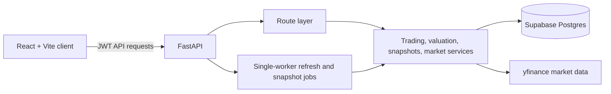

# Stock Game

Stock Game is a full-stack paper-trading simulator for US and Korean equities. It lets users run independent investment challenges, trade in KRW and USD, and compare portfolio returns with the S&P 500 and KOSPI without using real money.

**[Open the live app](https://stock-game-gray.vercel.app)** · API base `https://stock-game-6411.onrender.com`

> **v1.0.1 · Feature complete · Maintenance mode**
>
> The planned product scope is complete. New feature development is paused; maintenance is limited to security and dependency updates, production compatibility, regressions against the documented v1.0 behavior, and documentation corrections. See [MAINTENANCE.md](MAINTENANCE.md).

The verified release, deployment, security, test, and remaining-decision snapshot is recorded in [PROJECT_STATUS.md](PROJECT_STATUS.md).

Interactive API docs are a developer-environment feature and are disabled on the deployed API; see [Run locally](#run-locally) to browse them.

## Demo

Sign in with `demo` / `demo1234` to explore a pre-populated portfolio. The Render API uses free hosting, so the first request can take 30–60 seconds while the service starts.

## Screenshots

These v1.0.0 captures use deterministic demo data exercised through the automated browser core flow; they do not contain production user data.

### Game overview


### Active game and benchmark


### Portfolio


## Highlights

- Session-scoped games with configurable capital and duration; completed games remain available as read-only results.
- KRW/USD cash balances, live FX exchange, average-cost holdings, and realized/unrealized P&L.
- Benchmark, allocation, and holding-level analytics backed by periodic portfolio snapshots.
- Korean and English UI, a global user-level watchlist, and market browsing for US and Korean stocks.
- Ownership checks at every session-scoped API boundary; cross-user resources return 404.
- Rate limiting, bounded request validation, and hardened response headers on the API — see [Security](#security).
- An adaptive desktop sidebar/mobile tab bar, keyboard skip link, reduced-motion support, and a rendered browser test for the complete review flow.

## Architecture


```mermaid
flowchart LR
  Browser[React + Vite client] -->|JWT API requests| API[FastAPI]
  API --> Routes[Route layer]
  Routes --> Services[Trading, valuation, snapshots, market services]
  Services --> DB[(Supabase Postgres)]
  Services --> Market[yfinance market data]
  API --> Scheduler[Single-worker refresh and snapshot jobs]
  Scheduler --> Services
```

`GameSession` owns playable cash and state. Holdings, transactions, and portfolio snapshots are scoped by `game_session_id`; the watchlist is intentionally user-level. Routes authenticate with a custom JWT and use shared ownership helpers before reading or mutating a session.

## Security

The API is public and unmetered, so the controls below assume an anonymous caller with a script.

**Authentication and access**

- Custom JWT (HS256) with bcrypt password hashing. The server refuses to start without `JWT_SECRET_KEY`.
- Every session-scoped route resolves ownership through shared helpers; another user's session is a 404, not a 403.
- Interactive docs (`/docs`, `/redoc`, `/openapi.json`) are served only where `ENABLE_DEV_TOOLS=true`, matching the gate on the `/admin` fund routes. They fail closed on any other value.
- CORS allows exactly one origin per environment and disables credentialed requests, since the API reads a Bearer header and never a cookie.
- Every response carries `Strict-Transport-Security`, `X-Content-Type-Options`, `X-Frame-Options`, and `Referrer-Policy`.

**Rate limits** — all return `429` with a `Retry-After` header.

| Scope | Limit | Keyed on |
|---|---|---|
| Login | 20 / min, plus a 10 / min budget charged only on a failed attempt | Client address, then account |
| Register | 5 per 10 min | Client address and requested username |
| Market data | 120 / min | Client address |
| Trades | 60 / min | Account |

The account budget is charged only after credentials are checked and only when they were wrong, so a third party cannot spend it to lock an owner out of their own login.

**Request bounds**

- Ticker parameters must match a Yahoo symbol shape before they reach the upstream provider.
- Trade quantities are whole shares in `1 … 1,000,000,000`; money fields reject `Infinity` and `NaN`.
- The benchmark lookback is capped at 10 years, and an account may hold at most 20 active games.
- Market-data misses are cached too, so a loop over unknown symbols cannot force an outbound call per request.

Backend dependencies are pinned, and a test enforces the `react-router` floor so a reinstall cannot resolve backwards past a fixed advisory.
The Vercel deployment adds a restrictive Content Security Policy, GitHub vulnerability alerts and automated security fixes are enabled, and Dependabot checks npm, pip, and GitHub Actions dependencies weekly. The protected `main` branch requires the backend and frontend CI checks through a pull request.

## Tech stack

| Layer | Stack |
|---|---|
| Frontend | React 19, Vite, React Router, TanStack Query, Recharts, react-i18next |
| Backend | Python 3.11, FastAPI, SQLAlchemy, yfinance |
| Data | Supabase Postgres in production, SQLite for local development |
| Deployment | Vercel frontend, Render API |

## Run locally

Prerequisites: Python 3.11 and Node.js 20.19+ (or 22.12+).

### Backend

```bash
cd backend
python -m venv venv
source venv/bin/activate
pip install -r requirements.txt
pip install -r requirements-dev.txt
cp .env.example .env
# Set JWT_SECRET_KEY in .env, then:
uvicorn app.main:app --reload
```

The API starts at `http://127.0.0.1:8000`. Set `ENABLE_DEV_TOOLS=true` in `.env` to serve the interactive docs at `/docs`; they are off by default, including locally.

### Frontend

```bash
cd frontend
npm install
echo "VITE_API_URL=http://127.0.0.1:8000" > .env.local
npm run dev
```

The app starts at `http://localhost:5173`.

## Configuration

| Location | Variable | Required | Purpose |
|---|---|---|---|
| backend | `JWT_SECRET_KEY` | Yes | Signs access tokens; the server refuses to start without it. |
| backend | `DATABASE_URL` | No | Supabase Postgres connection URL; unset uses local SQLite. |
| backend | `FRONTEND_URL` | No | Sole allowed CORS origin. Unset means local dev, where the localhost dev servers are allowed instead. |
| backend | `ENABLE_DEV_TOOLS` | No | Enables the local-only balance adjustment endpoints and the interactive API docs. Keep unset in production. |
| frontend | `VITE_API_URL` | No | Backend API base URL. |
| frontend | `VITE_ENABLE_DEV_TOOLS` | No | Exposes local-only developer controls. Keep unset in production. |

## Verification

```bash
./scripts/regression-smoke.sh
cd frontend && npm test && npm run test:e2e && npm run build && npm run lint
cd ../backend && venv/bin/pytest && venv/bin/python -m compileall app tests
```

Install the Playwright Chromium runtime once with `cd frontend && npx playwright install chromium` before running the browser tests locally.

That is 275 backend tests, 23 frontend unit/config tests, and 2 rendered Chromium flows. GitHub Actions runs the same gates on every push and pull request.

The regression smoke covers authentication, games, trading, FX, analytics, ownership isolation, and delete boundaries. See [REGRESSION_SMOKE.md](REGRESSION_SMOKE.md) for coverage and manual QA limits.

## Known limitations

- Market data comes from yfinance, an unofficial source; the app uses caching and static fundamentals as fallbacks, but quotes can still be unavailable during an outage.
- The free Render service can cold-start slowly.
- Rate limiting is process-local and resets whenever the worker restarts, including deploys and routine recycling. That is sound for the single Gunicorn worker this service runs, but a multi-worker deployment should move the counters to a shared store such as Redis.
- Cash and holdings are stored as floats rather than integer minor units, so long chains of trades can accumulate sub-won rounding drift.
- Access tokens are stateless and last 7 days, so signing out clears the browser's copy but cannot invalidate a token already issued. There is no password-change flow.

## License

Copyright (c) 2026 Michael Ju. All rights reserved.
No license is granted for use, copying, modification, or distribution of this code as of 2026-07-30. This repository is public for portfolio review purposes only.
