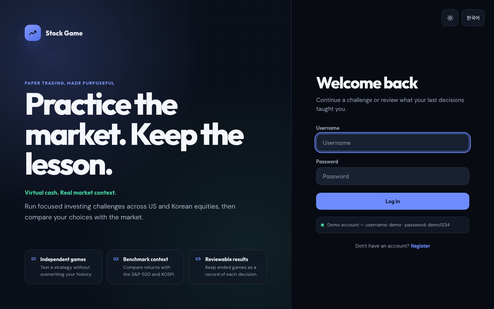
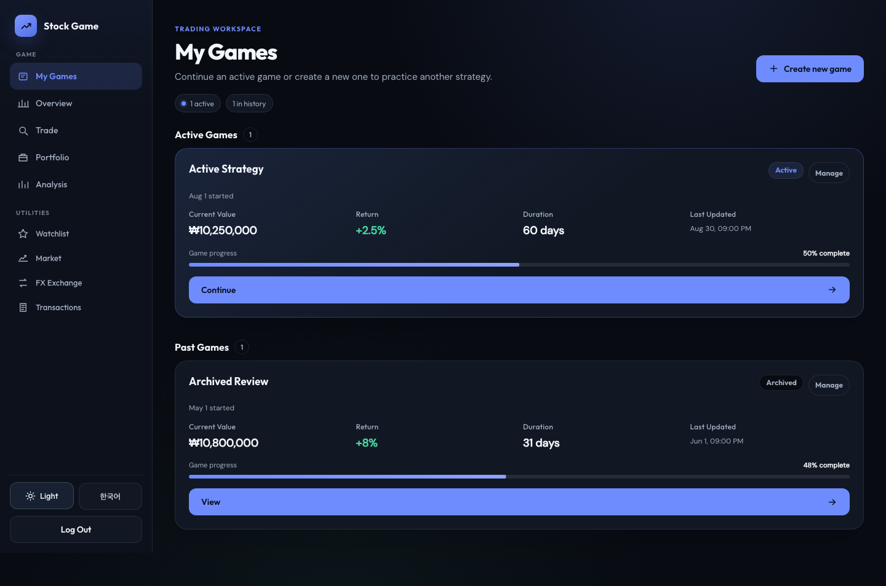
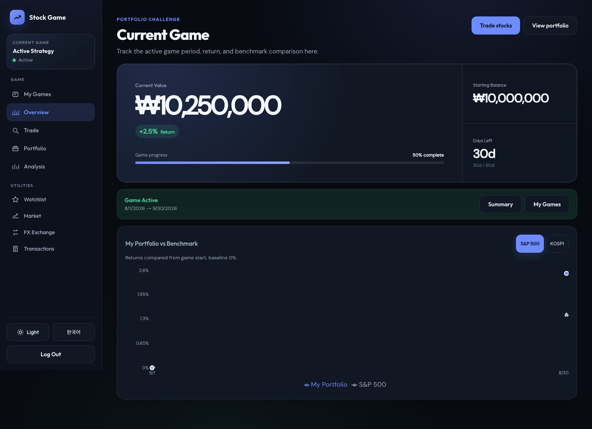
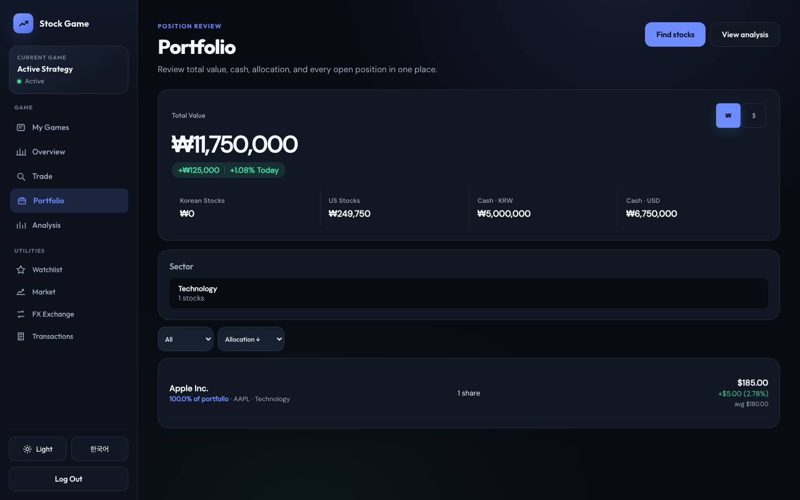
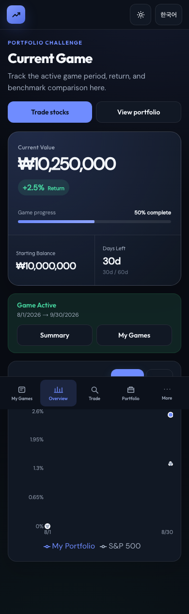
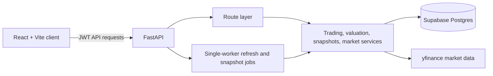

# Stock Game

Stock Game is a full-stack paper-trading simulator for US and Korean equities. It lets users run independent investment challenges, trade in KRW and USD, and compare portfolio returns with the S&P 500 and KOSPI without using real money.

**[Open the live app](https://stock-game-gray.vercel.app)** · API base `https://stock-game-6411.onrender.com`

> **v1.1.0 current · Feature complete · Maintenance mode**
>
> The planned product scope is complete. v1.1.0 is the explicitly approved showcase-interface maintenance release and adds no product scope. Feature development is paused; maintenance remains limited to security and dependency updates, production compatibility, regressions, and documentation corrections. See [MAINTENANCE.md](MAINTENANCE.md).

The verified release, deployment, security, test, and remaining-decision snapshot is recorded in [PROJECT_STATUS.md](PROJECT_STATUS.md).

Interactive API docs are a developer-environment feature and are disabled on the deployed API; see [Run locally](#run-locally) to browse them.

## Demo

Sign in with `demo` / `demo1234` to explore a pre-populated portfolio. This is a shared public account: visitors can change its state while the backend remains running, and the baseline is rebuilt on the next backend start. The Render API uses free hosting, so the first request can take 30–60 seconds while the service starts.

## Screenshots

These current maintenance-tree captures use the v1.1 interface and fixed, fixture-backed data exercised through the automated browser flows; they do not contain production user data.

### Sign in



### Game overview



### Active game and benchmark



### Portfolio



### Mobile game overview



## Highlights

- Session-scoped games with configurable capital and duration; completed games remain available as read-only results.
- KRW/USD cash balances, live FX exchange, average-cost holdings, and realized/unrealized P&L.
- Benchmark, allocation, and holding-level analytics backed by periodic portfolio snapshots.
- Korean and English UI, a global user-level watchlist, and market browsing for US and Korean stocks.
- Ownership checks at every session-scoped API boundary; cross-user resources return 404.
- Rate limiting, bounded request validation, and hardened response headers on the API — see [Security](#security).
- A dark-first showcase interface with an explicit light theme, contextual desktop sidebar, mobile tab bar, keyboard focus containment, and reduced-motion support. The interface contract is documented in [docs/UI_DESIGN.md](docs/UI_DESIGN.md).

## Architecture


```mermaid
flowchart LR
  Browser[React + Vite client] -->|JWT API requests| API[FastAPI]
  API --> Routes[Route layer]
  Routes --> Services[Trading, valuation, snapshots, market services]
  Services --> DB[(Supabase Postgres)]
  Services --> Market[yfinance market data]
  API --> Scheduler[Single-worker refresh and snapshot jobs]
  Scheduler --> Services
```

`GameSession` owns playable cash and state. Holdings, transactions, and portfolio snapshots are scoped by `game_session_id`; the watchlist is intentionally user-level. Routes authenticate with a custom JWT and use shared ownership helpers before reading or mutating a session.

On the client, each selected-game route mounts an explicit Session Portfolio scope that owns its API paths, query keys, and trade invalidation boundary. Legacy user-level Portfolio access remains isolated behind a compatibility adapter. Game lifecycle query orchestration and shared dialog keyboard/dismissal mechanics live in dedicated frontend modules; page components retain the product-specific rendering and copy.

## Security

The deployed API is internet-accessible. Authentication and market-data routes accept callers without an API key, so the controls below account for anonymous scripted traffic.

**Authentication and access**

- Custom JWT (HS256) with bcrypt password hashing. The server refuses to start without `JWT_SECRET_KEY`.
- Every session-scoped route resolves ownership through shared helpers; another user's session is a 404, not a 403.
- Interactive docs (`/docs`, `/redoc`, `/openapi.json`) are served only where `ENABLE_DEV_TOOLS=true`, matching the gate on the `/admin` fund routes. They fail closed on any other value.
- Production CORS allows the single configured `FRONTEND_URL`; local development allows the two documented localhost Vite origins. Credentialed requests are disabled because the API reads a Bearer header and never a cookie.
- Every response carries `Strict-Transport-Security`, `X-Content-Type-Options`, `X-Frame-Options`, and `Referrer-Policy`.

**Rate limits** — all return `429` with a `Retry-After` header.

| Scope | Limit | Keyed on |
|---|---|---|
| Login | 20 / min per address; 10 / min per account, charged only on failure; 600 / min process backstop | Client address, account, and process |
| Register | 5 per 10 min per address and username; 100 per 10 min process backstop | Client address, requested username, and process |
| Market data | 120 / min | Client address |
| Trades | 60 / min | Account |

The account budget is charged only after credentials are checked and only when they were wrong, so a third party cannot spend it to lock an owner out of their own login.

**Request bounds**

- Ticker parameters must match a Yahoo symbol shape before they reach the upstream provider.
- Trade quantities are whole shares in `1 … 1,000,000,000`; money fields reject `Infinity` and `NaN`.
- The benchmark lookback is capped at 10 years, and an account may hold at most 20 active games.
- Price and metadata lookup misses are cached briefly, so repeated requests for the same unknown symbol do not force an outbound call each time. Search, history, and other upstream-backed routes remain protected by the market-data rate limit.

Backend dependencies are pinned, and a test enforces the `react-router` floor so a reinstall cannot resolve backwards past a fixed advisory.
The Vercel deployment adds a restrictive Content Security Policy, GitHub vulnerability alerts and automated security fixes are enabled, and Dependabot checks npm, pip, and GitHub Actions dependencies weekly. CodeQL scans Actions, JavaScript/TypeScript, and Python with GitHub's default query suite. The protected `main` branch requires the backend and frontend CI checks through a pull request.

## Tech stack

| Layer | Stack |
|---|---|
| Frontend | React 19, Vite, React Router, TanStack Query, Recharts, react-i18next |
| Backend | Python 3.11, FastAPI, SQLAlchemy, yfinance |
| Data | Supabase Postgres in production, SQLite for local development |
| Deployment | Vercel frontend, Render API |

## Run locally

Prerequisites: Python 3.11 and Node.js 20.19+ (or 22.12+).

### Backend

```bash
cd backend
python -m venv venv
source venv/bin/activate
pip install -r requirements.txt
pip install -r requirements-dev.txt
cp .env.example .env
# Set JWT_SECRET_KEY in .env, then:
uvicorn app.main:app --reload
```

The API starts at `http://127.0.0.1:8000`. Set `ENABLE_DEV_TOOLS=true` in `.env` to serve the interactive docs at `/docs`; they are off by default, including locally.

### Frontend

```bash
cd frontend
npm install
echo "VITE_API_URL=http://127.0.0.1:8000" > .env.local
npm run dev
```

The app starts at `http://localhost:5173`.

## Configuration

| Location | Variable | Required | Purpose |
|---|---|---|---|
| backend | `JWT_SECRET_KEY` | Yes | Signs access tokens; the server refuses to start without it. |
| backend | `DATABASE_URL` | Production | Supabase Postgres connection URL; unset uses local SQLite for development. |
| backend | `FRONTEND_URL` | Production | Sole production CORS origin. Unset selects the documented localhost development origins. |
| backend | `ENABLE_DEV_TOOLS` | No | Enables the local-only balance adjustment endpoints and the interactive API docs. Keep unset in production. |
| frontend | `VITE_API_URL` | Production | Backend API base URL; development defaults to `http://127.0.0.1:8000`. |
| frontend | `VITE_ENABLE_DEV_TOOLS` | No | Exposes local-only developer controls. Keep unset in production. |

## Verification

```bash
./scripts/regression-smoke.sh
cd frontend && npm test && npm run test:e2e && npm run build && npm run lint
cd ../backend && venv/bin/pytest && venv/bin/python -m compileall app tests
```

Install the Playwright Chromium runtime once with `cd frontend && npx playwright install chromium` before running the browser tests locally.

That is 275 backend tests, 36 frontend unit/config tests, and 5 rendered Chromium flows. GitHub Actions runs the same gates for pull requests, pushes to `main`, and manual dispatches.

The regression smoke covers authentication, games, trading, FX, analytics, ownership isolation, and delete boundaries. See [REGRESSION_SMOKE.md](REGRESSION_SMOKE.md) for coverage and manual QA limits.

## Known limitations

- Market data comes from yfinance, an unofficial source; the app uses caching and static fundamentals as fallbacks, but quotes can still be unavailable during an outage.
- The free Render service can cold-start slowly.
- Rate limiting is process-local and resets whenever the worker restarts, including deploys and routine recycling. That is sound for the single Gunicorn worker this service runs, but a multi-worker deployment should move the counters to a shared store such as Redis.
- Cash and holdings are stored as floats rather than integer minor units, so long chains of trades can accumulate sub-won rounding drift.
- Access tokens are stateless and last 7 days, so signing out clears the browser's copy but cannot invalidate a token already issued. There is no password-change flow.

## License

Copyright (c) 2026 Michael Ju. All rights reserved.
No license is granted for use, copying, modification, or distribution of this code as of 2026-07-30. This repository is public for portfolio review purposes only.
